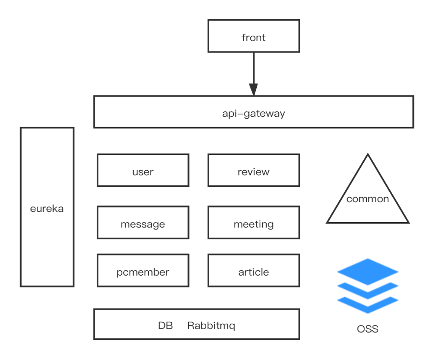
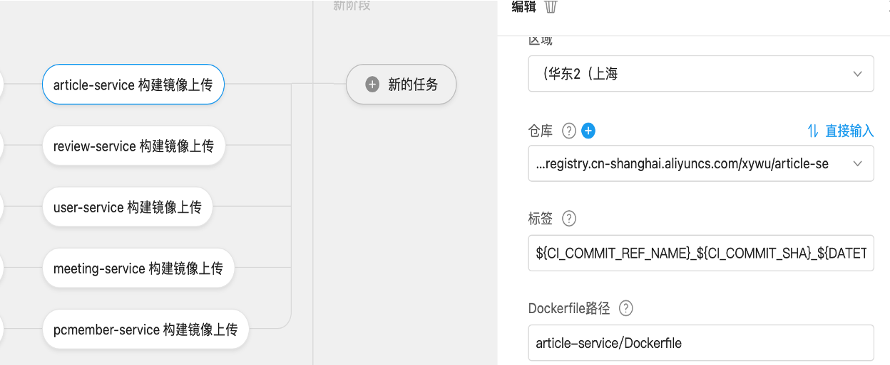

<!-- TOC -->

- [1. 拆分架构](#1-拆分架构)
- [2. 部署规范](#2-部署规范)
    - [2.1. 本地打包部署](#21-本地打包部署)
    - [2.2. 流水线CI自动打包](#22-流水线ci自动打包)
- [3. 镜像指南](#3-镜像指南)
- [4. 开发指南](#4-开发指南)
- [5. 分支规范](#5-分支规范)
- [6. 开发计划人员](#6-开发计划人员)

<!-- /TOC -->
# 1. 拆分架构


- 10个服务
6个后端基础服务
1个公共本地服务
前端
zuul网关
eureka服务注册中心

- 1个云存储服务
阿里云OSS

- 1个消息中间件
Rabbitmq

# 2. 部署规范
## 2.1. 本地打包部署
首先对后端进行打包，在跟根目录中运行 

```mvn clean package```

其次将前端进行打包成dist，在Cypberchair_frontend目录下 
```npm run build```

然后打包镜像，在根目录下运行 

```docker-compose build```

利用 docker-compose 运行 

```docker-compose up -d```
使用集群在集群部署：

使用助教云集群，文件quickstart.yml，service 的type是 Loadbalancer，由云提供商
分配port。
```sql
kubectl apply -f quickstart.yml

kubectl delete -f quickstart.yml
```

但在内网集群部署，文件quickstart-internal.yml，service 的type是 NodePort，自己指定NodePort，在内网访问。
目前可访问的地址是  10.176.122.6:30004

## 2.2. 流水线CI自动打包


# 3. 镜像指南
阿里云仓库镜像：
```sql
registry.cn-hangzhou.aliyuncs.com/xywu/cyber-frontend
registry.cn-hangzhou.aliyuncs.com/xywu/review-service
registry.cn-hangzhou.aliyuncs.com/xywu/pcmember-service
registry.cn-hangzhou.aliyuncs.com/xywu/article-service
registry.cn-hangzhou.aliyuncs.com/xywu/meeting-service
registry.cn-hangzhou.aliyuncs.com/xywu/user-service
registry.cn-hangzhou.aliyuncs.com/xywu/api-gateway
registry.cn-hangzhou.aliyuncs.com/xywu/eureka-server
```

docker-hub仓库镜像：
```sql
yzbrlan/cyber-frontend
yzbrlan/review-service
yzbrlan/pcmember-service
yzbrlan/article-service
yzbrlan/meeting-service
yzbrlan/user-service
yzbrlan/api-gateway
yzbrlan/eureka-server
```


# 4. 开发指南
- 拿到代码之后，在项目根目录运行`mvn clean package`进行编译。

- 用 docker-compose build 打包镜像

- 将镜像推送到阿里云仓库，先登陆阿里云镜像仓库，再推送  bash aliyun-push.sh

# 5. 分支规范
大家从dev分支切出来写代码，提交合并请求到dev分支，master分支保持原样

这里有一个分解的例子，可以照着写：https://github.com/yzbrlan/ts-high


# 6. 开发计划人员

项目架构，部署编译
- 吴茜雅

服务拆分，前后端服务开发
- 李向民
- 乔艺萌
- 庄天熠
- 杜小林

接口文档
- 郁思敏
- 徐焕珺

架构文档
- 张跃

服务设计文档
- 杨范
- 熊利洪